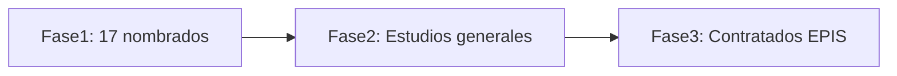

# Condiciones para docentes — EPIS

Reglas de negocio para la asignación de cursos y turnos de docentes **nombrados** en la Escuela Profesional de Ingeniería de Sistemas (EPIS), junto con el **flujo general de asignación** de docentes en la escuela.

En el sistema Schedule, los docentes se clasifican como `NOMBRADO`, `CONTRATADO` o `ESTUDIOS_GENERALES`, y los turnos disponibles son **Mañana** (`MANANA`), **Tarde** (`TARDE`) y **Noche** (`NOCHE`), definidos en `frontend/src/lib/constants.js`.

---

## Cupo de docentes nombrados

Solo puede haber **17 docentes nombrados** como máximo en la facultad.

Esta condición es una regla de negocio para quien gestione la programación académica. El sistema actual no impone este límite de forma automática; debe respetarse al registrar docentes en la aplicación.

---

## Flujo de trabajo de asignación

La asignación de docentes a cursos sigue este orden en **3 fases**:

| Fase | Actor | Acción |
|------|-------|--------|
| **1** | 17 docentes nombrados | Eligen sus cursos y turnos de carrera (con prioridad y límites descritos en este documento). |
| **2** | Estudios generales | Envía y asigna a sus docentes de estudios generales a los cursos EG. |
| **3** | Escuela (EPIS) | Contrata docentes para completar los cursos de carrera que queden sin cubrir. |

Los docentes nombrados tienen **prioridad** para elegir primero. Tras esa fase, interviene Estudios generales con sus docentes; al final, la escuela cubre con contratados los cursos de carrera pendientes.

El sistema distingue los tipos de docente y valida la categoría de curso en `TeacherService.java`, pero **no orquesta este flujo por fases** de forma automática; debe respetarse al gestionar la programación.

---

## Restricción por tipo de curso

- **Nombrados** y **contratados**: solo pueden escoger **cursos de carrera** (`CARRERA` / `DE_CARRERA` en el sistema).
- **Estudios generales**: solo pueden escoger **cursos de estudios generales** (`ESTUDIOS_GENERALES`).

Esta restricción ya está reflejada en el código mediante `getCourseCategoryForEmploymentType` en `frontend/src/lib/constants.js` y `expectedCourseCategory` en `TeacherService.java`.

---

## Modalidades de asignación por curso

Por cada curso que elige, un docente nombrado lo asigna en una de las siguientes modalidades de turno. Estas modalidades coinciden con las opciones del formulario de cursos en la aplicación (`frontend/src/components/courses/CourseForm.jsx`):

| Modalidad | Descripción |
|-----------|-------------|
| **Mañana y tarde** | El mismo docente dicta el curso en ambos turnos (opción «Mismo docente en ambos turnos»). |
| **Solo mañana** | El docente se asigna únicamente al turno mañana. |
| **Solo tarde** | El docente se asigna únicamente al turno tarde. |
| **Turno noche** | El docente se asigna al turno noche. |

### Nota sobre ciclos IX y X

Los cursos de **Ciclo IX** y **Ciclo X** son exclusivamente de turno noche. Para esos ciclos, la modalidad aplicable es **Turno noche** (regla ya reflejada en el sistema mediante `NIGHT_ONLY_CYCLES` en `frontend/src/lib/constants.js` y `CourseCycleRules` en el backend).

---

## Límite de elecciones por docente

Un docente nombrado puede elegir como máximo **2 espacios** en turnos de día (mañana/tarde). Esos 2 espacios se consumen de una de estas formas:

- **Opción A:** 1 curso en **ambos turnos** (mañana y tarde) → ocupa los 2 espacios.
- **Opción B:** 1 curso en **un turno** + **otro curso** en **otro turno** (p. ej. Curso A solo mañana + Curso B solo tarde) → también ocupa los 2 espacios.

**Excepción noche:** si el docente es de **turno noche**, conserva **un espacio adicional** para elegir un curso de noche (total: **3 elecciones** — 2 de día + 1 de noche).

| Situación | Elecciones válidas |
|-----------|-------------------|
| Sin turno noche | 1 curso mañana + tarde |
| Sin turno noche | 1 curso mañana + 1 curso tarde |
| Con turno noche | Lo anterior **más** 1 curso noche |

Esta condición es una regla de negocio para quien gestione la programación académica. El sistema actual no valida este límite de forma automática.

---

## Resumen de condiciones

- [ ] Máximo **17 docentes nombrados** en la facultad.
- [ ] Flujo en **3 fases**: nombrados → estudios generales → contratados para carrera pendiente.
- [ ] Los **nombrados eligen primero** sus cursos y turnos de carrera.
- [ ] **Nombrados y contratados**: solo **cursos de carrera**.
- [ ] **Estudios generales**: solo **cursos EG**.
- [ ] Máximo **2 elecciones** en turnos mañana/tarde (1 curso en ambos turnos **o** 2 cursos en turnos distintos).
- [ ] Docentes de **turno noche**: **1 espacio adicional** para un curso de noche.
- [ ] Cada curso elegido se asigna en una de estas modalidades: **mañana y tarde**, **solo mañana**, **solo tarde** o **turno noche** (en ciclos IX–X, solo noche).
---

## Anexo: Reporte de horas del Plan de Estudios 2024

Fuente: [`Reporte_Horas_Plan_Estudios_2024.pdf`](Reporte_Horas_Plan_Estudios_2024.pdf) — Universidad Nacional de Cañete, Escuela Profesional de Ingeniería de Sistemas.

Este anexo resume la carga horaria semanal de cada curso del plan vigente. Sirve como referencia al asignar docentes: la columna **TH** (total de horas semanales) indica cuántas horas académicas semanales demanda cada curso; **H. Real (45')** convierte esas horas a tiempo de reloj (1 hora académica = 45 min).

### Leyenda de abreviaturas

| Abreviatura | Significado |
|-------------|-------------|
| HT | Horas teóricas semanales |
| HP | Horas prácticas semanales |
| TH | Total de horas semanales (HT + HP) |
| H. Acad. | Horas académicas (equivale a TH; 1 h. acad. = 45 min) |
| Cred | Créditos del curso |
| H. Real (45') | Horas reales de reloj (TH × 45 min / 60) |
| H. Real Sem. | Horas reales semestrales (TH × 45 min) |
| Min. Sem. | Minutos semestrales (TH × 45 min) |

### Resumen general por tipo de estudio

| Tipo de estudio | Cursos | H. Acad. | Créditos | TH semanal | H. Reales (45') | Min. semestrales |
|-----------------|--------|----------|----------|------------|-----------------|------------------|
| Estudios Generales | 12 | 59 | 41 | 59 | 44.25 | 2 655 |
| Estudios Específicos | 13 | 60 | 44 | 60 | 45.00 | 2 700 |
| Estudios de Especialidad | 35 | 199 | 134 | 199 | 149.25 | 8 955 |
| Electivos | 2 | 8 | 6 | 8 | 6.00 | 360 |
| **Total** | **62** | **326** | **225** | **326** | **244.50** | **14 670** |

> Nota del reporte: 1 H. Acad. = 45 min. H. Reales = H. Acad. × 45/60.

### Resumen por ciclo

| Ciclo | Cursos | TH | H. Acad. | Créditos | H. Reales (45') | Min. semestrales |
|-------|--------|-----|----------|----------|-----------------|------------------|
| I | 6 | 32 | 32 | 22 | 24.00 | 1 440 |
| II | 6 | 32 | 32 | 22 | 24.00 | 1 440 |
| III | 6 | 31 | 31 | 22 | 23.25 | 1 395 |
| IV | 7 | 32 | 32 | 22 | 24.00 | 1 440 |
| V | 7 | 34 | 34 | 24 | 25.50 | 1 530 |
| VI | 6 | 34 | 34 | 23 | 25.50 | 1 530 |
| VII | 6 | 34 | 34 | 23 | 25.50 | 1 530 |
| VIII | 6 | 34 | 34 | 23 | 25.50 | 1 530 |
| IX | 6 | 32 | 32 | 22 | 24.00 | 1 440 |
| X | 6 | 31 | 31 | 22 | 23.25 | 1 395 |

Los ciclos **IX** y **X** concentran cursos de turno noche (ver sección «Nota sobre ciclos IX y X» arriba).

### Detalle por tipo de estudio

### Estudios Generales (ISEG)

| Código | Ciclo | Asignatura | HT | HP | TH | H. Acad. | Créd. | H. Real (45') |
|--------|-------|------------|----|----|-----|----------|-------|---------------|
| ISEG240101 | 1 | Comunicación | 2 | 4 | 6 | 6 | 4 | 4.50 |
| ISEG240102 | 1 | Matemática Básica I | 2 | 4 | 6 | 6 | 4 | 4.50 |
| ISEG240103 | 1 | Métodos de Estudios Universitarios | 2 | 4 | 6 | 6 | 4 | 4.50 |
| ISEG240104 | 1 | Derechos Fundamentales de la Persona y de la Sociedad | 2 | 2 | 4 | 4 | 3 | 3.00 |
| ISEG240201 | 2 | Herramientas Digitales | 1 | 4 | 5 | 5 | 3 | 3.75 |
| ISEG240202 | 2 | Matemática Básica II | 2 | 4 | 6 | 6 | 4 | 4.50 |
| ISEG240203 | 2 | Desarrollo Personal | 2 | 2 | 4 | 4 | 3 | 3.00 |
| ISEG240301 | 3 | Filosofía y Ética | 2 | 2 | 4 | 4 | 3 | 3.00 |
| ISEG240302 | 3 | Realidad Nacional e Internacional | 2 | 2 | 4 | 4 | 3 | 3.00 |
| ISEG240303 | 3 | Emprendimiento e Innovación | 2 | 4 | 6 | 6 | 4 | 4.50 |
| ISEG240401 | 4 | Cultura Ambiental y Responsabilidad Social | 2 | 2 | 4 | 4 | 3 | 3.00 |
| ISEG240402 | 4 | Derecho Empresarial | 2 | 2 | 4 | 4 | 3 | 3.00 |

*Total: 12 cursos | 59 H. Acad. | 41 créditos | 44.25 H. Reales*

### Estudios Específicos (ISEE)

| Código | Ciclo | Asignatura | HT | HP | TH | H. Acad. | Créd. | H. Real (45') |
|--------|-------|------------|----|----|-----|----------|-------|---------------|
| ISEE240105 | 1 | Teoría General de Sistemas | 2 | 2 | 4 | 4 | 3 | 3.00 |
| ISEE240204 | 2 | Física General | 3 | 2 | 5 | 5 | 4 | 3.75 |
| ISEE240304 | 3 | Matemática Superior | 3 | 4 | 7 | 7 | 5 | 5.25 |
| ISEE240305 | 3 | Investigación Operativa I | 2 | 2 | 4 | 4 | 3 | 3.00 |
| ISEE240403 | 4 | Estadística y Probabilidades | 2 | 2 | 4 | 4 | 3 | 3.00 |
| ISEE240404 | 4 | Investigación Operativa II | 2 | 2 | 4 | 4 | 3 | 3.00 |
| ISEE240501 | 5 | Estadística Inferencial | 2 | 2 | 4 | 4 | 3 | 3.00 |
| ISEE240701 | 7 | Metodología de la Investigación Científica | 2 | 2 | 4 | 4 | 3 | 3.00 |
| ISEE240801 | 8 | Proceso de la Investigación Científica | 2 | 2 | 4 | 4 | 3 | 3.00 |
| ISEE240901 | 9 | Seminario de Tesis I | 2 | 2 | 4 | 4 | 3 | 3.00 |
| ISEE240902 | 9 | Práctica Preprofesional I | 2 | 4 | 6 | 6 | 4 | 4.50 |
| ISEE241001 | 10 | Seminario de Tesis II | 2 | 2 | 4 | 4 | 3 | 3.00 |
| ISEE241002 | 10 | Práctica Preprofesional II | 2 | 4 | 6 | 6 | 4 | 4.50 |

*Total: 13 cursos | 60 H. Acad. | 44 créditos | 45.00 H. Reales*

### Estudios de Especialidad (ISES)

| Código | Ciclo | Asignatura | HT | HP | TH | H. Acad. | Créd. | H. Real (45') |
|--------|-------|------------|----|----|-----|----------|-------|---------------|
| ISES240106 | 1 | Algoritmo y Fundamentos de Programación | 2 | 4 | 6 | 6 | 4 | 4.50 |
| ISES240205 | 2 | Estructura de Datos | 2 | 4 | 6 | 6 | 4 | 4.50 |
| ISES240206 | 2 | Dibujo CAD | 2 | 4 | 6 | 6 | 4 | 4.50 |
| ISES240306 | 3 | Programación Orientada a Objetos | 2 | 4 | 6 | 6 | 4 | 4.50 |
| ISES240405 | 4 | Sistemas Digitales | 1 | 4 | 5 | 5 | 3 | 3.75 |
| ISES240406 | 4 | Fundamentos de Base de Datos | 1 | 4 | 5 | 5 | 3 | 3.75 |
| ISES240407 | 4 | Desarrollo Web Full Stack | 2 | 4 | 6 | 6 | 4 | 4.50 |
| ISES240502 | 5 | Introducción al Networking | 2 | 2 | 4 | 4 | 3 | 3.00 |
| ISES240503 | 5 | Arquitectura de Computadoras | 2 | 4 | 6 | 6 | 4 | 4.50 |
| ISES240504 | 5 | Administración de Base de Datos | 2 | 4 | 6 | 6 | 4 | 4.50 |
| ISES240505 | 5 | Desarrollo de Aplicaciones Móviles | 2 | 4 | 6 | 6 | 4 | 4.50 |
| ISES240506 | 5 | Simulación de Sistemas | 2 | 2 | 4 | 4 | 3 | 3.00 |
| ISES240507 | 5 | Ingeniería de Costos | 2 | 2 | 4 | 4 | 3 | 3.00 |
| ISES240601 | 6 | Diseño de Redes de Comunicaciones | 2 | 4 | 6 | 6 | 4 | 4.50 |
| ISES240602 | 6 | Configuración de Servidores | 2 | 2 | 4 | 4 | 3 | 3.00 |
| ISES240603 | 6 | Data Warehouse | 2 | 4 | 6 | 6 | 4 | 4.50 |
| ISES240604 | 6 | Arquitectura de Software | 2 | 4 | 6 | 6 | 4 | 4.50 |
| ISES240605 | 6 | Inteligencia Artificial y Sistemas Expertos | 2 | 4 | 6 | 6 | 4 | 4.50 |
| ISES240606 | 6 | Diseño de Procesos de Negocios | 2 | 4 | 6 | 6 | 4 | 4.50 |
| ISES240702 | 7 | Administración de Redes de Comunicaciones | 2 | 4 | 6 | 6 | 4 | 4.50 |
| ISES240703 | 7 | Big Data | 2 | 4 | 6 | 6 | 4 | 4.50 |
| ISES240704 | 7 | Desarrollo de Aplicaciones con DevOps | 2 | 4 | 6 | 6 | 4 | 4.50 |
| ISES240705 | 7 | Machine Learning | 2 | 4 | 6 | 6 | 4 | 4.50 |
| ISES240706 | 7 | Análisis de Sistemas | 2 | 4 | 6 | 6 | 4 | 4.50 |
| ISES240802 | 8 | Seguridad y Criptografía | 2 | 4 | 6 | 6 | 4 | 4.50 |
| ISES240803 | 8 | Internet de las Cosas | 2 | 4 | 6 | 6 | 4 | 4.50 |
| ISES240804 | 8 | Testing y Aseguramiento de la Calidad en Desarrollo de Software | 2 | 4 | 6 | 6 | 4 | 4.50 |
| ISES240805 | 8 | Deep Learning | 2 | 4 | 6 | 6 | 4 | 4.50 |
| ISES240806 | 8 | Gestión de Proyectos | 2 | 4 | 6 | 6 | 4 | 4.50 |
| ISES240903 | 9 | Ciberseguridad | 2 | 4 | 6 | 6 | 4 | 4.50 |
| ISES240904 | 9 | Programación Funcional y Reactiva | 2 | 4 | 6 | 6 | 4 | 4.50 |
| ISES240905 | 9 | Inteligencia de Negocios | 2 | 4 | 6 | 6 | 4 | 4.50 |
| ISES241003 | 10 | Cloud Computing | 2 | 4 | 6 | 6 | 4 | 4.50 |
| ISES241004 | 10 | Auditoría y Legislación de TI | 2 | 4 | 6 | 6 | 4 | 4.50 |
| ISES241005 | 10 | Gestión de Proyectos Sistémicos | 3 | 2 | 5 | 5 | 4 | 3.75 |

*Total: 35 cursos | 199 H. Acad. | 134 créditos | 149.25 H. Reales*

### Electivos (ISEL)

| Código | Ciclo | Asignatura | HT | HP | TH | H. Acad. | Créd. | H. Real (45') |
|--------|-------|------------|----|----|-----|----------|-------|---------------|
| IS-ELECTIVO-I | 9 | Electivo I (SIG, Digital TWN, IA Marketing, Realidad Virtual) | 2 | 2 | 4 | 4 | 3 | 3.00 |
| IS-ELECTIVO-II | 10 | Electivo II (SIG, Digital TWN, IA Marketing, Realidad Virtual) | 2 | 2 | 4 | 4 | 3 | 3.00 |

*Total: 2 cursos | 8 H. Acad. | 6 créditos | 6.00 H. Reales*

