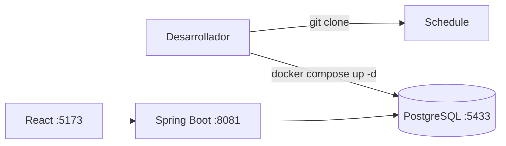

# Guía Docker — Schedule

Instrucciones para clonar el proyecto y levantar **PostgreSQL** con Docker Compose. Pensada para quien empieza desde cero.

---

## Qué hace Docker en este proyecto

Docker **no ejecuta la aplicación completa**. Solo corre la **base de datos PostgreSQL** en tu PC de forma aislada y reproducible.

El backend Java (Spring Boot) se conecta a esa base de datos. Sin Docker, el login y los usuarios **no persisten** entre reinicios.



---

## Requisitos previos

| Herramienta | Obligatorio para Docker | Para qué |
|-------------|-------------------------|----------|
| **Git** | Sí | Clonar el repositorio |
| **Docker Engine + Docker Compose** | Sí | Levantar PostgreSQL |
| Java 21 + Maven | No (paso posterior) | Backend — ver [README](../README.md) |
| Node.js + npm/pnpm | No (paso posterior) | Frontend y desktop — ver [README](../README.md) |

### Instalar Docker

- **Linux:** [https://docs.docker.com/engine/install/](https://docs.docker.com/engine/install/)
- **Windows:** [Docker Desktop](https://docs.docker.com/desktop/setup/install/windows-install/)
- **macOS:** [Docker Desktop](https://docs.docker.com/desktop/setup/install/mac-install/)

Comprobar instalación:

```bash
docker --version
docker compose version
```

En Linux, tu usuario debe poder ejecutar Docker (grupo `docker`) o usar `sudo` según tu configuración.

---

## 1. Clonar el proyecto

```bash
git clone git@github.com:envysinho/scheduleapp.git
cd scheduleapp
```

Si usas HTTPS:

```bash
git clone https://github.com/envysinho/scheduleapp.git
cd scheduleapp
```

> La carpeta puede llamarse `scheduleapp` o `Schedule` según cómo clones el repo. Lo importante es estar en la **raíz**, donde está el archivo `docker-compose.yml`.

---

## 2. Levantar PostgreSQL

Desde la raíz del proyecto:

```bash
docker compose up -d
```

Verificar que el contenedor está activo:

```bash
docker compose ps
```

Salida esperada (aproximada):

```text
NAME                IMAGE         STATUS    PORTS
schedule-postgres   postgres:16   Up        0.0.0.0:5433->5432/tcp
```

### Datos de conexión (desarrollo)

| Parámetro | Valor |
|-----------|--------|
| Host | `localhost` |
| Puerto | **5433** (en tu PC; dentro del contenedor es 5432) |
| Base de datos | `schedule_db` |
| Usuario | `schedule` |
| Contraseña | `schedule` |

- **Contenedor:** `schedule-postgres`
- **Volumen:** `schedule_pg_data` — los datos **persisten** aunque hagas `docker compose down` (sin `-v`).

El backend ya está configurado para conectarse a `localhost:5433` por defecto ([`backend/src/main/resources/application.properties`](../backend/src/main/resources/application.properties)).

---

## 3. Comprobar que funciona

```bash
# Estado del servicio
docker compose ps

# Últimas líneas del log
docker compose logs postgres --tail 20

# Entrar a PostgreSQL y listar tablas (opcional)
docker exec -it schedule-postgres psql -U schedule -d schedule_db -c "\dt"
```

Si el contenedor está `Up` y no hay errores en los logs, la base de datos está lista.

---

## 4. Comandos útiles del día a día

| Acción | Comando |
|--------|---------|
| Parar la BD | `docker compose stop` |
| Volver a arrancar | `docker compose start` |
| Parar y quitar el contenedor | `docker compose down` |
| **Borrar todos los datos** (reset) | `docker compose down -v` |
| Ver logs en tiempo real | `docker compose logs -f postgres` |
| Limpiar contenedores huérfanos | `docker compose down --remove-orphans` |

---

## 5. Siguiente paso: arrancar la app completa

Con PostgreSQL en marcha, sigue el [README](../README.md):

1. `docker compose up -d` ← ya hecho
2. `cd backend && mvn spring-boot:run` → API en `http://localhost:8081`
3. `cd frontend && npm install && npm run dev` → UI en `http://localhost:5173`
4. `cd desktop && npm install && pnpm start` → app de escritorio (opcional)

**Login inicial:** usuario `admin`, contraseña `admin123`.

Más detalle sobre usuarios y persistencia: [USUARIOS-Y-PERSISTENCIA.md](./USUARIOS-Y-PERSISTENCIA.md).

---

## Problemas frecuentes

### Puerto 5433 en uso

Otro proceso ya usa el puerto. Opciones:

- Liberar el puerto (identificar con `ss -tlnp | grep 5433` en Linux).
- Cambiar el mapeo en [`docker-compose.yml`](../docker-compose.yml), por ejemplo `"5434:5432"`, y actualizar `DB_URL` / `application.properties`.

### Confusión con el puerto 5432

Muchas instalaciones traen PostgreSQL nativo en **5432**. Este proyecto usa **5433** en el host para evitar conflictos. Conéctate siempre al **5433** salvo que hayas cambiado la configuración.

### `Port 8081 was already in use` (backend)

No es un problema de Docker. Ya hay otra instancia de Spring Boot corriendo. Cierra la terminal anterior con `Ctrl+C` o mata el proceso Java que ocupa el 8081.

### Contenedor `schedule-mysql` huérfano

Puede aparecer si quedó un contenedor de una configuración antigua con MySQL. No afecta a PostgreSQL. Para limpiarlo:

```bash
docker compose down --remove-orphans
```

### El backend no conecta a la base de datos

1. `docker compose ps` → `schedule-postgres` debe estar **Up**.
2. Revisa que [`application.properties`](../backend/src/main/resources/application.properties) tenga `jdbc:postgresql://localhost:5433/schedule_db`.
3. Revisa logs: `docker compose logs postgres`.

### Permiso denegado al ejecutar Docker (Linux)

Añade tu usuario al grupo docker y vuelve a iniciar sesión, o ejecuta los comandos con `sudo` (menos recomendable para desarrollo diario).

---

## Resumen rápido

```bash
git clone git@github.com:envysinho/scheduleapp.git
cd scheduleapp
docker compose up -d
docker compose ps
# Luego: backend + frontend según README.md
```
