# Horarios de turnos — EPIS

Franjas horarias oficiales de los turnos académicos en la Escuela Profesional de Ingeniería de Sistemas (EPIS).

En el sistema Schedule, estos turnos corresponden a los valores `MANANA`, `TARDE` y `NOCHE` definidos en `frontend/src/lib/constants.js`.

> **Valores activos:** un administrador puede ajustarlos desde **Reglas → Horarios del día** en la app. Los cambios se persisten en PostgreSQL. Ver [`REGLAS-HORARIOS-CONFIGURABLES.md`](REGLAS-HORARIOS-CONFIGURABLES.md).

| Turno | Código | Inicio | Fin | Duración |
|-------|--------|--------|-----|----------|
| Mañana | `MANANA` | 08:00 | 12:30 | 4 h 30 min |
| Tarde | `TARDE` | 14:00 | 17:00 | 3 h |
| Noche | `NOCHE` | 17:15 | 22:30 | 5 h 15 min |

## Horarios de comidas del estudiante

Los turnos académicos no incluyen las siguientes franjas reservadas para las comidas del estudiante:

| Comida | Inicio | Fin | Duración |
|--------|--------|-----|----------|
| Desayuno | 06:30 | 08:00 | 1 h 30 min |
| Almuerzo | 12:30 | 14:00 | 1 h 30 min |
| Cena | 17:00 | 17:15 | 15 min |

## Resumen

- **Turno mañana:** 08:00 – 12:30
- **Turno tarde:** 14:00 – 17:00
- **Turno noche:** 17:15 – 22:30

> Los turnos académicos comienzan al terminar el desayuno (08:00), el almuerzo (14:00) y la cena (17:15). Entre turno mañana y tarde (12:30 – 14:00) y entre tarde y noche (17:00 – 17:15) no hay clases: corresponden al almuerzo y la cena respectivamente.

## Línea de tiempo del día académico

```mermaid
gantt
  title Dia academico EPIS
  dateFormat HH:mm
  axisFormat %H:%M
  section Comidas
  Desayuno  :06:30, 90min
  Almuerzo  :12:30, 90min
  Cena      :17:00, 15min
  section Turnos
  Manana    :08:00, 270min
  Tarde     :14:00, 180min
  Noche     :17:15, 315min
```

