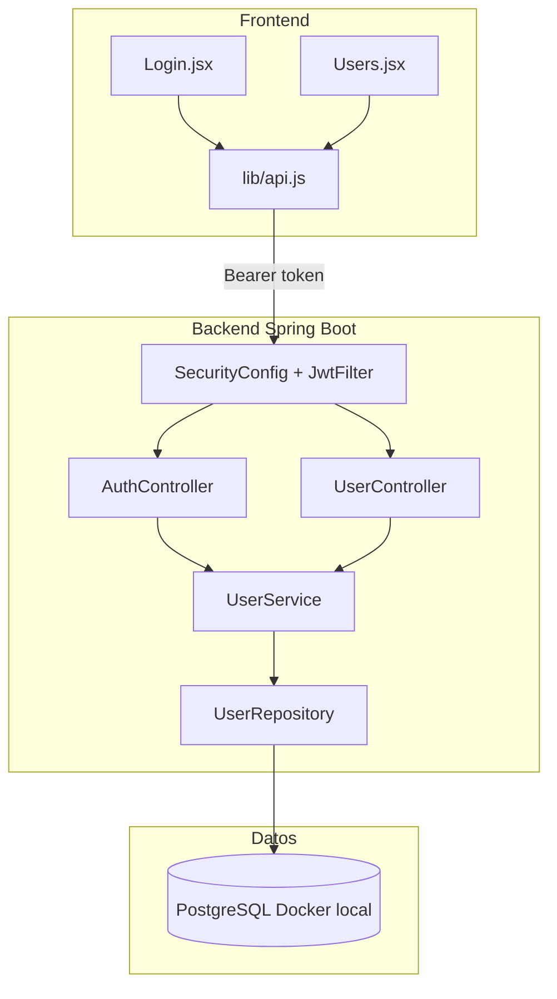

# Usuarios, autenticación y persistencia — Schedule

Documento de referencia del proyecto. Define **qué hacer ahora** (desarrollo) y **qué dejar para después** (usuarios reales en producción).

---

## Resumen ejecutivo

| Fase | Objetivo | Infraestructura |
|------|----------|-----------------|
| **Ahora** | CRUD completo de usuarios + login real con JWT | Docker Compose + PostgreSQL **local** en tu PC |
| **Después** | Varios usuarios compartiendo los mismos datos | Backend + PostgreSQL en **servidor central** (VPS o PC-servidor LAN) |

**Importante:** Docker y PostgreSQL no son alternativas. PostgreSQL es la base de datos; Docker es solo la forma cómoda de correrla en desarrollo.

---

## Situación actual del código

| Capa | Estado hoy |
|------|------------|
| Backend | `POST /api/auth/login` valida contra PostgreSQL; devuelve JWT real |
| Backend | `GET/POST/PUT/DELETE /api/users` — CRUD protegido (solo ADMIN) |
| Backend | Spring Security + JPA + BCrypt + PostgreSQL (Java 21) |
| Frontend | Login guarda `{ user, token }` en `sessionStorage` durante la ventana abierta |
| Frontend | `api.js` envía `Authorization: Bearer` en peticiones protegidas |
| Frontend | Existen pantallas funcionales para usuarios, docentes, cursos, horarios, espacios y reglas |

Archivos clave:

- `backend/src/main/java/com/example/schedule/controller/AuthController.java`
- `backend/src/main/java/com/example/schedule/controller/UserController.java`
- `frontend/src/lib/auth.js`
- `frontend/src/lib/api.js`
- `frontend/src/pages/Login.jsx`
- `frontend/src/pages/Users.jsx`
- `frontend/src/contexts/AuthContext.jsx`

---

## Guía rápida: añadir usuarios desde la app

```text
1. docker compose up -d          ← levanta PostgreSQL (puerto 5433)
2. cd backend && mvn spring-boot:run
3. cd frontend && pnpm dev
4. cd desktop && pnpm start      ← opcional
5. Login: admin / admin123
6. Sidebar → Usuarios → formulario "Nuevo usuario"
```

**Qué hace cada paso:**

| Paso | Para qué sirve |
|------|----------------|
| Docker | Corre la base de datos donde se guardan usuarios |
| Backend | API que valida login y ejecuta el CRUD |
| Frontend | Interfaz web (Vite en :5173) |
| Desktop | Ventana Electron que carga el frontend |

**En la pantalla Usuarios:**

- **Tabla izquierda:** lista de cuentas (usuario, rol, activo/inactivo).
- **Formulario derecho:** crear usuario nuevo o editar uno seleccionado (lápiz).
- **Papelera:** desactiva la cuenta (no borra el registro de la BD).

No necesitas entrar a Docker ni a PostgreSQL para el uso normal.

---

## Fase 1 — AHORA (implementar primero)

Objetivo: autenticación real y CRUD de usuarios en una sola pasada de implementación.

### Checklist

- [x] Crear `docker-compose.yml` en la raíz con PostgreSQL 16 y volumen persistente
- [x] Añadir dependencias Maven: JPA, PostgreSQL, Security, Validation, JWT
- [x] Actualizar `java.version` a **21** en `backend/pom.xml`
- [x] Configurar `application.properties` con variables de entorno
- [x] Crear entidad `User`, `UserRepository`, DTOs
- [x] Implementar `UserService` con BCrypt
- [x] Configurar Spring Security + JWT (login + filtro Bearer)
- [x] Refactorizar `AuthController` y crear `UserController`
- [x] Seed inicial: usuario `admin` / `admin123` con rol `ADMIN`
- [x] Crear `frontend/src/lib/api.js` (cliente HTTP con token)
- [x] Crear `frontend/src/pages/Users.jsx` (CRUD admin)
- [x] Integrar página Usuarios en `App.jsx` y `AppSidebar.jsx`
- [x] Probar flujo completo: login → CRUD → reinicio → datos persisten

### 1. Base de datos local (Docker)

Archivo nuevo: `docker-compose.yml`

```yaml
services:
  postgres:
    image: postgres:16
    container_name: schedule-postgres
    environment:
      POSTGRES_DB: schedule_db
      POSTGRES_USER: schedule
      POSTGRES_PASSWORD: schedule
    ports:
      - "5433:5432"
    volumes:
      - schedule_pg_data:/var/lib/postgresql/data

volumes:
  schedule_pg_data:
```

Arrancar:

```bash
docker compose up -d
```

### 2. Configuración Spring Boot

Añadir en `backend/src/main/resources/application.properties`:

```properties
server.port=8081

spring.datasource.url=${DB_URL:jdbc:postgresql://localhost:5433/schedule_db}
spring.datasource.username=${DB_USER:schedule}
spring.datasource.password=${DB_PASSWORD:schedule}
spring.jpa.hibernate.ddl-auto=update
spring.jpa.show-sql=false

app.jwt.secret=${JWT_SECRET:cambiar-en-produccion-min-256-bits}
app.jwt.expiration-ms=86400000
```

### 3. Dependencias Maven

Añadir en `backend/pom.xml`:

- `spring-boot-starter-data-jpa`
- `org.postgresql:postgresql`
- `spring-boot-starter-security`
- `spring-boot-starter-validation`
- `io.jsonwebtoken:jjwt-api`, `jjwt-impl`, `jjwt-jackson`

### 4. Modelo de datos

Tabla `users`:

| Campo | Tipo | Notas |
|-------|------|-------|
| `id` | BIGINT PK | Autogenerado |
| `username` | VARCHAR | Único, obligatorio |
| `password_hash` | VARCHAR | BCrypt — **nunca** texto plano |
| `role` | VARCHAR | `ADMIN` o `USER` |
| `enabled` | BOOLEAN | `false` = desactivado |
| `created_at` | TIMESTAMP | Opcional |
| `updated_at` | TIMESTAMP | Opcional |

### 5. API REST

**Auth (público)**

| Método | Ruta | Body | Respuesta |
|--------|------|------|-----------|
| POST | `/api/auth/login` | `{ "username", "password" }` | `{ "user": { "username", "role" }, "token": "<jwt>" }` |

**Usuarios (protegido — solo ADMIN)**

| Método | Ruta | Descripción |
|--------|------|-------------|
| GET | `/api/users` | Listar usuarios |
| GET | `/api/users/{id}` | Detalle |
| POST | `/api/users` | Crear usuario + contraseña |
| PUT | `/api/users/{id}` | Editar datos y/o contraseña |
| DELETE | `/api/users/{id}` | Eliminar o desactivar |

Todas las rutas protegidas requieren header:

```
Authorization: Bearer <token>
```

### 6. Seguridad

- `POST /api/auth/login` → acceso público
- Resto de `/api/**` → JWT válido obligatorio
- `/api/users/**` → solo rol `ADMIN`
- CORS: `http://127.0.0.1:5173`, `http://localhost:5173`
- Contraseñas: `BCryptPasswordEncoder`

### 7. Frontend

**`frontend/src/lib/api.js`**

- Lee el token de la sesión (`auth.js`)
- Añade `Authorization: Bearer ...` en cada petición
- Si responde `401` → logout y volver a login

**`frontend/src/pages/Users.jsx`**

- Tabla: username, rol, activo
- Formulario crear/editar
- Eliminar/desactivar
- Visible solo si `user.role === 'ADMIN'`

### 8. Cómo probar (desarrollo)

```bash
# Terminal 1 — BD
docker compose up -d

# Terminal 2 — Backend
cd backend && mvn spring-boot:run

# Terminal 3 — Frontend
cd frontend && npm run dev

# Terminal 4 — Desktop (opcional)
cd desktop && pnpm start
```

Credenciales iniciales: `admin` / `admin123`

Prueba rápida con curl:

```bash
# Login
curl -s -X POST http://127.0.0.1:8081/api/auth/login \
  -H "Content-Type: application/json" \
  -d '{"username":"admin","password":"admin123"}'

# Listar usuarios (sustituir TOKEN)
curl -s http://127.0.0.1:8081/api/users \
  -H "Authorization: Bearer TOKEN"
```

### 9. Criterios de éxito (fase 1)

- [x] Login con `admin`/`admin123` valida contra PostgreSQL, no contra constantes Java
- [x] Token JWT obligatorio para `/api/users/**`
- [x] CRUD de usuarios funciona desde API y pantalla admin
- [x] Contraseñas hasheadas en BD; nunca en JSON de respuesta
- [x] Reiniciar backend/PostgreSQL mantiene los datos
- [x] Backend corre en Java 21, puerto `8081`

### 10. Qué NO tocar en esta fase

- CRUD de docentes, cursos, aulas y horarios
- Empaquetado Electron para producción
- Registro público (solo admin crea usuarios)

---

## Fase 2 — DESPUÉS (usuarios reales en producción)

Objetivo: que varias personas usen la app compartiendo **los mismos datos** (usuarios, horarios, etc.).

### Escenario recomendado

```text
[Usuario A - Electron] ──┐
                         ├──► [Servidor: Spring Boot + PostgreSQL]
[Usuario B - Electron] ──┘
```

- **Un solo servidor** con backend Java + PostgreSQL central.
- Cada cliente Electron apunta al servidor, **no** a `localhost`.
- **No** instalar Docker en cada laptop de usuario final.

### Pasos pendientes (anotar para más adelante)

- [ ] Elegir hosting: VPS en internet **o** PC-servidor en red de la institución
- [ ] Instalar PostgreSQL en el servidor (nativo o contenedor solo en el servidor)
- [ ] Desplegar backend Spring Boot (jar + systemd, Docker solo en servidor, etc.)
- [ ] Configurar variables de entorno en producción:
  - `DB_URL`, `DB_USER`, `DB_PASSWORD`
  - `JWT_SECRET` (secreto fuerte, distinto al de desarrollo)
- [ ] Cambiar contraseña del admin por defecto
- [ ] Configurar `VITE_API_BASE_URL` en el frontend/build apuntando al servidor
- [ ] HTTPS reverse proxy (nginx/Caddy) si el servidor es accesible por internet
- [ ] Backups automáticos de PostgreSQL
- [ ] Documentar instalación para el equipo de la institución

### Variables en producción (ejemplo)

```bash
DB_URL=jdbc:postgresql://servidor-interno:5432/schedule_db
DB_USER=schedule_prod
DB_PASSWORD=<secreto-fuerte>
JWT_SECRET=<secreto-jwt-largo>
VITE_API_BASE_URL=https://horarios.institucion.edu/api
```

### Alternativa: cada PC independiente

Solo si **no** necesitan compartir datos entre equipos:

- H2 en archivo local **o** PostgreSQL por máquina
- Más fácil de instalar, pero cada PC tiene su propia copia de datos
- No recomendado para un gestor de horarios institucional compartido

---

## Qué NO usar para persistencia de usuarios

| Almacenamiento | Sirve para | No sirve para |
|----------------|------------|---------------|
| `sessionStorage` (frontend) | Token de sesión durante la ventana abierta | CRUD de usuarios, contraseñas |
| Archivos sueltos en Electron | Config ligera | Datos relacionales, seguridad |

Los usuarios y contraseñas van siempre en **backend Java + base de datos relacional**.

---

## Arquitectura objetivo (fase 1)



---

## Próximos módulos (después del CRUD de usuarios)

Mismo patrón para cada dominio:

1. Entity JPA
2. Repository
3. Service
4. Controller REST protegido con JWT
5. Página React con `api.js`

Entidades futuras: docentes, cursos, aulas, horarios.

---

## Historial

| Fecha | Nota |
|-------|------|
| 2026-06-29 | Fase 1 implementada. PostgreSQL en puerto **5433**. CRUD desde pantalla Usuarios. |
